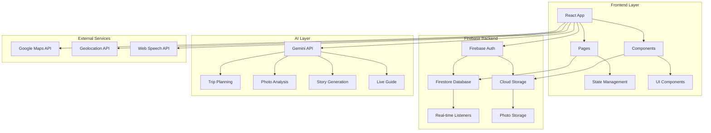
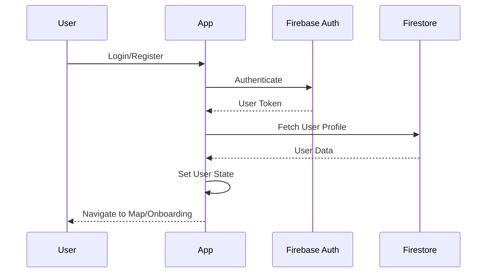
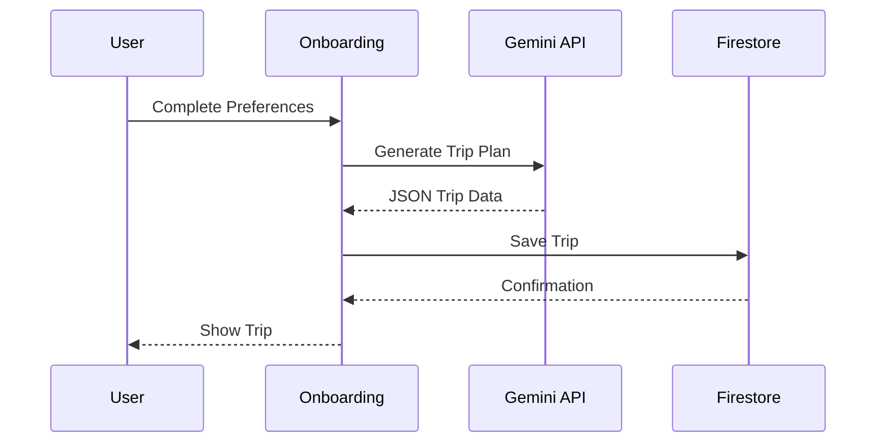
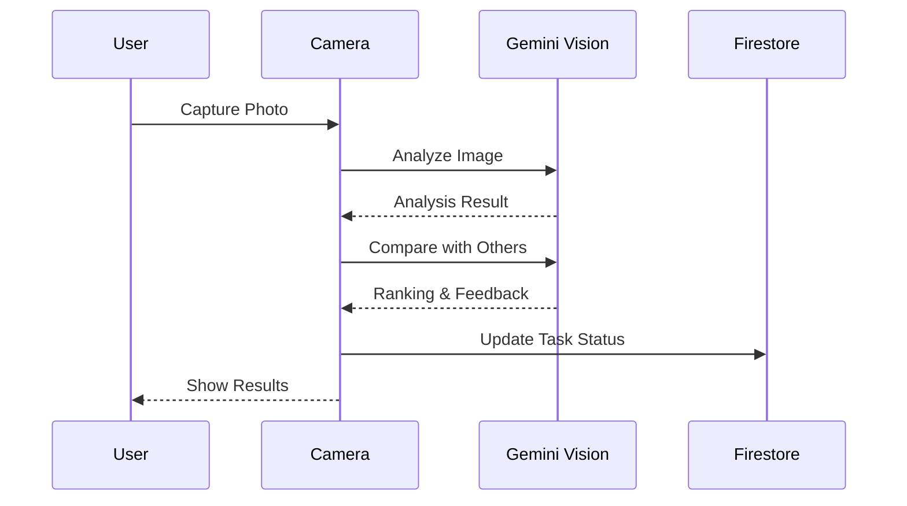

# EGYPTOUR Architecture Documentation

## System Overview

EGYPTOUR is a progressive web application built with React and TypeScript, leveraging Firebase for backend services and Google Gemini AI for intelligent features.

## Architecture Diagram



## Data Flow

### User Authentication Flow



### Trip Generation Flow



### Photo Analysis Flow



## Firebase Structure

### Firestore Collections

```
users/
  {userId}/
    - profile (document)
      - uid
      - email
      - displayName
      - language
      - interests
      - budget
      - pace
      - stats
      - aiPersonality
      - badges
      - createdAt
      - updatedAt
    
    trips/
      active_trip/ (document)
        - id
        - title
        - days
        - missions[]
        - progress
        - createdAt
        - updatedAt
    
    discoveredSecrets/
      {secretId}/ (document)
        - secretId
        - discoveredAt
    
    gallery/
      {photoId}/ (document)
        - url
        - timestamp
        - missionId
        - location
        - type

globalSecrets/
  {secretId}/ (document)
    - secretId
    - discoveredCount
    - firstDiscoveredAt
    - lastDiscoveredAt
```

### Storage Structure

```
users/
  {userId}/
    gallery/
      {photoId}.jpg
```

## Component Hierarchy

```
App
├── Welcome
├── Login
├── Register
├── Onboarding
│   └── PersonalitySelector
├── MapView
│   ├── Google Maps
│   └── Mission Markers
├── Journey
│   └── Mission Cards
├── MissionDetail
│   ├── Hidden Secrets
│   └── Task List
├── CameraCapture
│   ├── AR Overlay
│   └── Photo Analysis
├── LiveGuide
│   └── Camera Feed
├── Profile
│   ├── PersonalitySelector
│   └── Gallery
├── JourneyStory
└── BottomNav
```

## State Management

### Global State (App.tsx)

- `currentView`: Current active view
- `authUser`: Firebase user object
- `user`: User profile data
- `activeTrip`: Current trip data
- `selectedMission`: Currently selected mission
- `isOnline`: Network connectivity status

### Local State

Each component manages its own local state using React hooks:
- `useState` for simple state
- `useEffect` for side effects
- `useRef` for mutable references
- `useMemo` for computed values
- `useCallback` for memoized functions

## API Integration Details

### Gemini API Integration

**Location**: `lib/gemini.ts`

**Functions**:
- `getGeminiClient()`: Initialize client
- `analyzePhotoComparison()`: Analyze and rank photos
- `verifyPhotoMission()`: Verify photo matches requirements
- `analyzeBonusPhoto()`: Detect special moments

**Models Used**:
- `gemini-2.0-flash`: Vision analysis, trip planning
- `gemini-3-flash-preview`: Story generation, chat

**Error Handling**:
- Retry logic with exponential backoff
- Fallback responses
- Comprehensive error messages

### Firebase Integration

**Location**: `lib/firebase.ts`

**Functions**:
- Authentication: `signUpWithEmail`, `signInWithEmail`, `signInWithGoogle`
- Profile: `getUserProfile`, `updateUserProfile`, `updateUserStats`
- Trips: `saveTrip`, `getTrip`, `updateTrip`
- Missions: `updateMissionStatus`, `updateTaskStatus`
- Secrets: `saveDiscoveredSecret`, `checkSecretDiscovered`

### Google Maps Integration

**Location**: `pages/MapView.tsx`

**Features**:
- Interactive map with custom markers
- Real-time location tracking
- Mission markers with status colors
- Hidden secrets markers
- User location indicator

## Security

### Firestore Security Rules

```javascript
rules_version = '2';
service cloud.firestore {
  match /databases/{database}/documents {
    match /users/{userId} {
      allow read, write: if request.auth != null && request.auth.uid == userId;
      
      match /{subcollection}/{document=**} {
        allow read, write: if request.auth != null && request.auth.uid == userId;
      }
    }
    
    match /{document=**} {
      allow read, write: if false;
    }
  }
}
```

### API Key Security

- API keys stored in environment variables
- Never committed to repository
- Restricted API keys in production
- CORS configuration for Maps API

## Performance Optimizations

### Code Splitting

- Lazy loading for heavy components
- React Suspense for async components
- Dynamic imports where applicable

### Image Optimization

- Compression before upload (0.7 quality)
- Thumbnail generation for gallery
- Lazy loading for images

### API Call Optimization

- Throttling for frame capture (500ms)
- Debouncing for user input
- Caching for frequently accessed data
- Retry logic with backoff

### Rendering Optimization

- `useMemo` for expensive computations
- `useCallback` for stable function references
- React.memo for component memoization
- Virtual scrolling for long lists

## File Structure

```
egyptour/
├── components/           # Reusable UI components
│   ├── BottomNav.tsx
│   ├── PersonalitySelector.tsx
│   ├── AROverlay.tsx
│   └── icons/
├── lib/                  # Core utilities
│   ├── firebase.ts       # Firebase config & functions
│   ├── gemini.ts         # Gemini API utilities
│   └── secrets.ts        # Hidden secrets data
├── pages/                # Application pages
│   ├── Welcome.tsx
│   ├── Login.tsx
│   ├── Register.tsx
│   ├── Onboarding.tsx
│   ├── MapView.tsx
│   ├── Journey.tsx
│   ├── MissionDetail.tsx
│   ├── CameraCapture.tsx
│   ├── LiveGuide.tsx
│   ├── Profile.tsx
│   ├── JourneyStory.tsx
│   └── Gallery.tsx
├── constants/            # Application constants
│   └── index.ts
├── types.ts              # TypeScript definitions
├── App.tsx               # Main app component
├── index.tsx             # Entry point
├── vite.config.ts        # Vite configuration
├── tsconfig.json         # TypeScript configuration
├── firestore.rules       # Firestore security rules
├── storage.rules         # Storage security rules
└── package.json          # Dependencies
```

## Environment Variables

```env
# Required
VITE_GEMINI_API_KEY=your_gemini_api_key
VITE_GOOGLE_MAPS_API_KEY=your_maps_api_key
VITE_GOOGLE_MAPS_MAP_ID=your_map_id

# Optional
VITE_FIREBASE_API_KEY=your_firebase_api_key
VITE_FIREBASE_AUTH_DOMAIN=your_project.firebaseapp.com
VITE_FIREBASE_PROJECT_ID=your_project_id
VITE_FIREBASE_STORAGE_BUCKET=your_project.firebasestorage.app
```

## Deployment Architecture

### Development
- Local development server (Vite)
- Hot module replacement
- Source maps enabled

### Production
- Optimized build (Vite)
- Code minification
- Asset compression
- CDN for static assets
- Firebase Hosting or Vercel

## Monitoring & Analytics

### Error Tracking
- Console error logging
- User-friendly error messages
- Error boundaries (future enhancement)

### Performance Monitoring
- Lighthouse audits
- Core Web Vitals
- API response times

## Future Enhancements

- [ ] Offline mode with service workers
- [ ] Push notifications
- [ ] Social sharing integration
- [ ] Multi-language support expansion
- [ ] Advanced AR features
- [ ] Quiz system implementation
- [ ] Leaderboard system
- [ ] Achievements system

