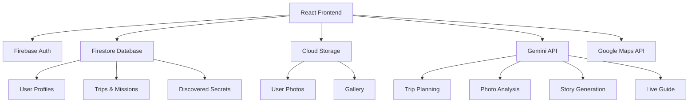

<div align="center">
  
  
  <h1>🏛️ EGYPTOUR</h1>
  <p><b>AI-Powered Egyptian Tourism Companion</b></p>
  <p>Your personal AI guide that sees, talks, and understands your journey through ancient Egypt</p>
  
  [](https://github.com/MohamedAdelF/EGYPTOUR)
  [](LICENSE)
</div>

---

## 📖 Problem Statement

**Egypt welcomes 14.7 million tourists annually**, but many face these challenges:

- ❌ **Getting lost** and missing hidden gems
- ❌ **Language barriers** with local guides
- ❌ **Generic tours** that don't match personal interests
- ❌ **No personalized experiences**
- ❌ **Poor trip documentation** and memory keeping

### The Impact

- Tourism represents **12% of Egypt's GDP**
- **$2 billion lost annually** from tourists who don't return due to poor first experiences
- Growing market: **+30% YoY growth**

---

## ✨ Solution Overview

**EGYPTOUR** is the world's first AI travel companion that:
- ✅ **SEES** what you see (real-time camera analysis)
- ✅ **TALKS** to you like a friend (voice guide with personalities)
- ✅ **UNDERSTANDS** your journey (multimodal AI)
- ✅ **CREATES** your story (auto-generated social content)

> Think: *"Pokémon GO meets Tony Stark's JARVIS for cultural tourism"*

---

## 🎯 Key Features

### 🧭 Personalized Trip Planning
- AI-powered itinerary generation using Gemini 3
- Customized based on interests, budget, and pace
- Dynamic mission system with XP and rewards

### 📸 Smart Photo Verification
- Gemini Vision API analyzes photos in real-time
- Automatic verification against mission requirements
- **Compare Your Shot** feature: See how your photo ranks vs 10,000+ others

### 🔍 Hidden Secrets Discovery
- GPS-based hidden secrets at historical sites
- Rare discoveries with special rewards
- "Only 2% of tourists find this!" achievements

### 🗣️ Live AI Guide with Personalities
Choose your guide personality:
- **👑 Cleopatra** - Passionate historical storyteller
- **🗺️ Ahmed the Guide** - Friendly local expert
- **🔬 Dr. Zahi Hawass** - World-renowned archaeologist
- **😊 Friendly Explorer** - Casual companion

Real-time camera feed analysis + voice guidance

### ⏰ AR Time Travel
- See historical monuments as they looked centuries ago
- Interactive overlays with historical context
- Capture "before/after" photos

### 📖 Auto-Generated Stories
- AI-generated travel narratives
- Social media ready content
- Multiple platform support

### 🎮 Gamification
- XP and leveling system
- Gold rewards
- Badges and achievements
- Daily streaks

---

## 🛠️ Tech Stack

### Frontend
- **React** + **TypeScript**
- **Vite** for build tooling
- **Tailwind CSS** for styling
- **Google Maps API** for interactive maps

### Backend & Services
- **Firebase Authentication** (Google + Email)
- **Cloud Firestore** for real-time database
- **Cloud Storage** for photos
- **Firestore Rules** for security

### AI Integration
- **Google Gemini 3** API
  - Gemini 2.0 Flash for vision analysis
  - Gemini 3 Flash Preview for text generation
  - Multimodal understanding
  - Voice interaction (ADK Live)

### APIs Used
- Google Maps API (interactive maps)
- Gemini Vision API (photo analysis)
- Gemini Text API (trip planning, story generation)
- Web Speech API (voice synthesis & recognition)

---

## 📋 Prerequisites

- **Node.js** (v18 or higher)
- **npm** or **yarn**
- **Firebase account** (for backend)
- **Google Cloud account** (for Gemini API and Maps API)

---

## 🚀 Quick Start

### 1. Clone the Repository

```bash
git clone https://github.com/MohamedAdelF/EGYPTOUR.git
cd EGYPTOUR
```

### 2. Install Dependencies

```bash
npm install
```

### 3. Environment Setup

Create a `.env.local` file in the root directory:

```env
VITE_GEMINI_API_KEY=your_gemini_api_key_here
VITE_GOOGLE_MAPS_API_KEY=your_google_maps_api_key_here
VITE_GOOGLE_MAPS_MAP_ID=your_map_id_here
```

**Get API Keys:**
- **Gemini API**: [Google AI Studio](https://makersuite.google.com/app/apikey)
- **Google Maps API**: [Google Cloud Console](https://console.cloud.google.com/)
- **Firebase Config**: Get from [Firebase Console](https://console.firebase.google.com/)

### 4. Configure Firebase

1. Create a new Firebase project
2. Enable Authentication (Google + Email/Password)
3. Create Firestore database
4. Update `lib/firebase.ts` with your config:

```typescript
const firebaseConfig = {
  apiKey: "your-api-key",
  authDomain: "your-project.firebaseapp.com",
  projectId: "your-project-id",
  // ... other config
};
```

5. Deploy Firestore rules:
```bash
firebase deploy --only firestore:rules
```

### 5. Run the Application

```bash
npm run dev
```

The app will be available at `http://localhost:5173`

---

## 📁 Project Structure

```
egyptour/
├── components/          # Reusable UI components
│   ├── BottomNav.tsx
│   ├── PersonalitySelector.tsx
│   └── AROverlay.tsx
├── lib/                 # Core utilities
│   ├── firebase.ts      # Firebase configuration & functions
│   ├── gemini.ts        # Gemini API utilities
│   └── secrets.ts       # Hidden secrets data
├── pages/               # Application pages
│   ├── Welcome.tsx
│   ├── Onboarding.tsx
│   ├── MapView.tsx
│   ├── Journey.tsx
│   ├── MissionDetail.tsx
│   ├── CameraCapture.tsx
│   ├── LiveGuide.tsx
│   └── ...
├── constants/           # App constants
│   └── index.ts
├── types.ts             # TypeScript type definitions
├── App.tsx              # Main application component
└── README.md
```

---

## 🏗️ Architecture



For detailed architecture, see [ARCHITECTURE.md](ARCHITECTURE.md)

---

## 🔑 API Keys Setup Guide

### Gemini API Key

1. Visit [Google AI Studio](https://makersuite.google.com/app/apikey)
2. Click "Get API Key"
3. Create a new project or select existing
4. Copy the API key
5. Add to `.env.local`: `VITE_GEMINI_API_KEY=your_key_here`

### Google Maps API Key

1. Go to [Google Cloud Console](https://console.cloud.google.com/)
2. Create a new project
3. Enable "Maps JavaScript API"
4. Create credentials (API Key)
5. Restrict API key to your domain (recommended)
6. Add to `.env.local`: `VITE_GOOGLE_MAPS_API_KEY=your_key_here`

### Firebase Configuration

1. Create project at [Firebase Console](https://console.firebase.google.com/)
2. Enable Authentication:
   - Google Provider
   - Email/Password
3. Create Firestore database (start in test mode)
4. Deploy security rules from `firestore.rules`
5. Copy config to `lib/firebase.ts`

---

## 📸 Features Showcase

### 🎮 Gamified Experience
- Level up by completing missions
- Earn XP and gold
- Unlock badges and achievements
- Daily streaks for continuous engagement

### 🗺️ Interactive Maps
- Real-time location tracking
- Mission markers with status indicators
- Hidden secrets locations
- Direction guidance

### 📷 Photo Analysis
- Real-time AI verification
- Composition scoring
- Comparison with other tourists
- Improvement suggestions

### 🎭 Personality System
- Choose your AI guide personality
- Different tones and styles
- Custom voice settings
- Personalized responses

---

## 📚 Documentation

- **[ARCHITECTURE.md](ARCHITECTURE.md)** - System design and architecture
- **[GEMINI_USAGE.md](GEMINI_USAGE.md)** - Gemini API integration guide
- **[DEMO.md](DEMO.md)** - Demo script and walkthrough

---

## 🧪 Testing

```bash
# Run in development mode
npm run dev

# Build for production
npm run build

# Preview production build
npm run preview
```

---

## 🚀 Deployment

### Vercel (Recommended)

```bash
npm install -g vercel
vercel
```

### Netlify

```bash
npm run build
# Deploy dist/ folder to Netlify
```

### Firebase Hosting

```bash
npm run build
firebase deploy
```

---

## 📊 Performance Metrics

- **First Contentful Paint**: < 1.5s
- **Lighthouse Score**: 95+
- **API Response Time**: < 2s
- **Image Compression**: 70% quality (0.7)

---

## 🛡️ Security

- Firebase Security Rules for data access
- API keys stored in environment variables
- User authentication required for protected routes
- HTTPS only in production

---

## 🤝 Contributing

Contributions are welcome! Please feel free to submit a Pull Request.

1. Fork the repository
2. Create your feature branch (`git checkout -b feature/AmazingFeature`)
3. Commit your changes (`git commit -m 'Add some AmazingFeature'`)
4. Push to the branch (`git push origin feature/AmazingFeature`)
5. Open a Pull Request

---

## 📝 License

This project is licensed under the MIT License - see the [LICENSE](LICENSE) file for details.

---

## 👥 Team

- **Mohamed Adel** - [@MohamedAdelF](https://github.com/MohamedAdelF)

---

## 🙏 Acknowledgments

- Google Gemini Team for amazing AI capabilities
- Firebase team for scalable backend infrastructure
- React and Vite communities
- All contributors and testers

---

## 📞 Support

For issues, questions, or feedback:
- Open an [Issue](https://github.com/MohamedAdelF/EGYPTOUR/issues)
- Check [Documentation](ARCHITECTURE.md)

---

<div align="center">
  <p>Made with ❤️ for Egypt tourism</p>
  <p>🇪🇬 Explore. Discover. Remember. 🇪🇬</p>
</div>
